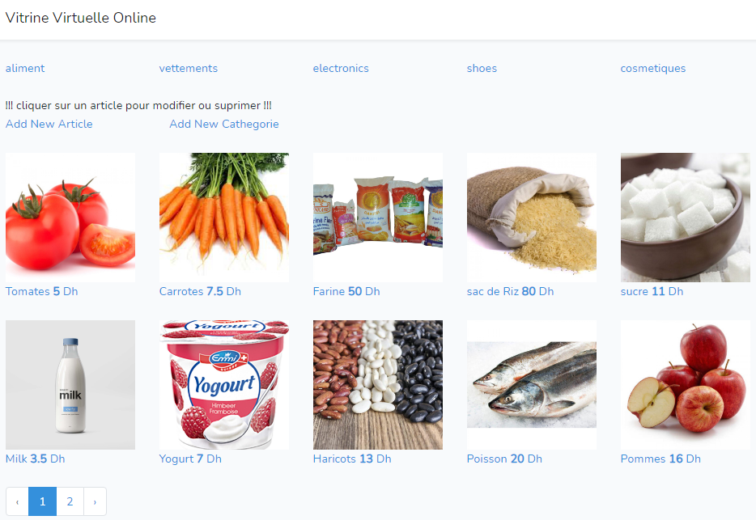

# vitrine virtuelle

## important !!!
if images are not showing or adding image not working:  
1. open the folder: **public** in the project  
2. delete the folder: **storage**  
3. run the comand `php artisan storage:link`  
and you're good to go !

## License

The Laravel framework is open-sourced software licensed under the [MIT license](https://opensource.org/licenses/MIT).
